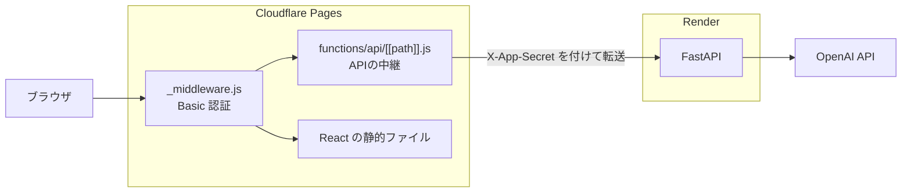
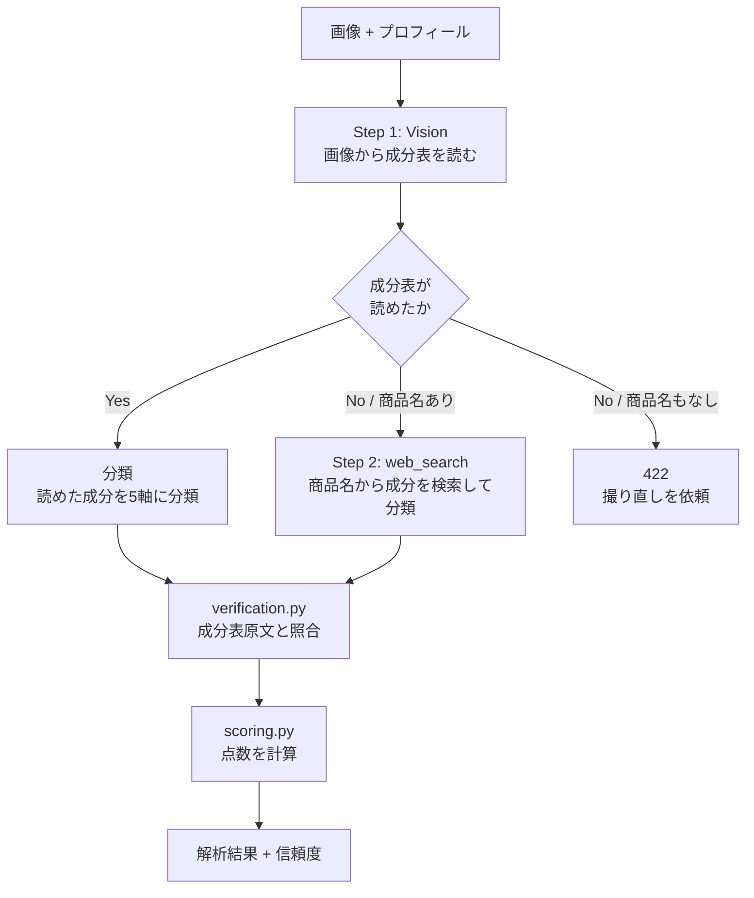

# コスメ成分解析アプリ 🌸

化粧品のパッケージを撮影すると、**成分表を AI が読み取って分類し、Python が採点する** Web アプリです。

コスメを買うときに「これは自分に合うのか」を毎回調べ直すのが面倒だったので作りました。
あわせて、個人開発で「企画 → 設計 → 実装 → デプロイ」を一人で一通り通すことを目的にしています。

| | |
|---|---|
| 構成 | React (Cloudflare Pages) + FastAPI (Render) + OpenAI API |
| 状態 | 本番稼働中（Basic 認証で限定公開） |
| 設計の詳細 | **[DESIGN.md](./DESIGN.md)** — なぜその作りにしたかを13章で解説 |

---

## 目次

- [何をするアプリか](#何をするアプリか)
- [なぜ作っているか](#なぜ作っているか)
- [技術スタック](#技術スタック)
- [システム構成](#システム構成)
- [設計の中心にある3つの考え方](#設計の中心にある3つの考え方)
- [ローカルで動かす](#ローカルで動かす)
- [ディレクトリ構成](#ディレクトリ構成)
- [API](#api)
- [デプロイ](#デプロイ)
- [ドキュメントの使い分け](#ドキュメントの使い分け)
- [既知の制約](#既知の制約)

---

## 何をするアプリか

1. 化粧品のパッケージ裏面（成分表）をスマホで撮影する
2. 成分表を読み取り、成分ごとに5つの効果軸で分類する
3. あらかじめ設定したプロフィール（肌質・年代・重視する効果）と突き合わせ、**相性スコア**を出す

成分表が読めなかった場合は、商品名から Web 検索して成分を調べる経路に切り替わります。

### 評価の5軸

| 軸 | キー |
|---|---|
| 保湿・うるおい | `moisturizing` |
| 鎮静・肌あれケア | `soothing` |
| ハリ・エイジングケア | `anti_aging` |
| 透明感・くすみケア | `brightening` |
| 毛穴・皮脂ケア | `pore` |

軸に採用する条件は2つだけです。**「成分表から判定できること」**と**「利用者が自分で答えられること」**。片方でも欠けるものは軸にしません（→ [DESIGN.md 6.1](./DESIGN.md#61-5軸の選定基準)）。

「安全性」を軸に入れていないのは、性質が違うからです。効果は人によって要る／要らないが分かれますが、安全性は全員が高いほうがいい。同じレーダーに並べると意味が読めなくなるため、**刺激リスク**として独立させています。

---

## なぜ作っているか

### 題材として「コスメ」を選んだ理由

**実際に自分が困っていたからです。**

最近は韓国コスメや美容液の選択肢が一気に増えました。そのぶん、買うときにこういうことが起きます。

| 困っていたこと | このアプリでの答え |
|---|---|
| **成分表が読めない** — 韓国語や英語で書かれている | 画像から読み取って日本語に正規化する |
| **安全性や効果が分からない** — 成分名を見ても判断できない | 成分ごとに5軸で分類し、刺激リスクを別枠で出す |
| **調べるのが面倒** — 1本ごとに成分を検索していられない | 撮るだけで済ませる |
| **手持ちのコスメを見直せない** — 買ったあとは調べ直さない | 履歴に残して、あとから見返せる |

### いちばん効いた気づき：口コミは、その人の話でしかない

口コミを読んでいると、こういう文が並びます。

> 「**乾燥肌の私には**合いませんでした」
> 「**30代になってから**物足りなく感じます」

これを見て気づいたのは、**コスメの良し悪しは、その人の属性を抜きにしては決まらない**ということでした。同じ製品が、ある人には正解で、別の人には不正解になる。**万人に通用する点数は、そもそも存在しません。**

この気づきが、そのまま設計になっています。

- **レーダーチャート** = この製品の実力（誰が見ても同じ）
- **相性スコア** = あなたが重視する軸の平均（人によって変わる）

**この2つを分けているのが、このアプリの一番の要点です。** 製品を格付けするのではなく、「あなたにとってどうか」だけを答えます。

だから採点対象は、**本人が選んだ軸だけ**に限定しています。求めていない軸を分母に入れると、保湿だけを求めている人に保湿100点のクリームを見せても満点になりません。「求めていないものができていない」のは、その人にとって欠点ではないからです（→ [DESIGN.md 6.3](./DESIGN.md#63-計算式)）。

### この形は、コスメ以外にも応用できると思っている

このアプリの骨格を抽象化すると、こうなります。

```
表示が義務づけられたラベル  ×  個人の属性  →  相性
```

**この形が成り立つ分野は他にもあります。** すぐ思いつくのは食品のアレルギー表示です。原材料表示は重量の多い順に書く決まりがあり、これは化粧品の全成分表示が配合量の多い順に並ぶ規則と同じ構造です。**順序を「どれくらい入っているか」の代理指標に使える**という、このアプリの中核の仮定がそのまま通ります。

サプリメント、ペットフード、洗剤なども同じ形に当てはまりそうです。

ただし**今回はコスメだけに絞っています。** 学習目的のプロジェクトで対象を広げると、どれも中途半端になるからです。まず1分野で「企画からデプロイまで」を完走することを優先しています。

### 作るうえで優先していること

- **動くことより、なぜそうしたかを残すこと** — 判断の記録を [DESIGN.md](./DESIGN.md) に書いています
- **やらないことを決めること** — DB もログインも CI も、いまは意図的に入れていません（→ [DESIGN.md 11章](./DESIGN.md#11-意図的にやっていないこと)）

利用者を増やすことや収益化は目的にしていません。**アクセスは Basic 認証で絞っています。**

---

## 技術スタック

| 領域 | 技術 |
|---|---|
| フロントエンド | React 19 / TypeScript / Vite 8 |
| スタイリング | Tailwind CSS 4 |
| グラフ描画 | Recharts 3 |
| HTTP 通信 | axios |
| バックエンド | Python 3.12 / FastAPI / Pydantic |
| AI | OpenAI Responses API（`gpt-4o-mini` / Vision・Web Search） |
| ホスティング（画面） | Cloudflare Pages + Pages Functions |
| ホスティング（API） | Render |
| データ保存 | ブラウザの localStorage のみ（サーバは状態を持たない） |

---

## システム構成



**なぜ2社に分けているか** — Cloudflare Pages は静的配信に強い一方で Python を動かせず、Render は Python を動かせます。それぞれの得意分野を使っています。

**なぜ API を直接呼ばないか** — ブラウザから Render を直接叩くと、CORS の設定が必要になり、Render の URL が利用者に見え、合言葉をフロントの JS に埋め込むことになります。Pages Functions を1枚挟むと、ブラウザからは画面も API も同一オリジンに見え、これらがすべて解消します（→ [DESIGN.md 2章](./DESIGN.md#2-システム構成)）。

---

## 設計の中心にある3つの考え方

### 1. LLM に点数を出させない

LLM がやるのは**成分ごとの分類だけ**です。点数は Python が計算します。

```
LLM    … 「セラミドは保湿に3、刺激リスク0」という分類（得意）
Python … その合計から点数を出す（確実・毎回同じ・説明できる）
```

「0〜100点で相性を答えて」と頼むと、73点と78点の違いを定義した人が誰もいないまま、それらしい数字が生成されます。同じ画像でも結果がブレますし、なぜその点数かを説明できません。

**副産物として、肌質や年代を OpenAI に送る必要がなくなりました。** 個人情報が外部に出ず、同じ製品なら常に同じ分類が返るのでキャッシュも可能になります。

→ [DESIGN.md 5章](./DESIGN.md#5-設計の中核llm-とコードの境界)

### 2. LLM の出力を、成分表の原文と突き合わせる

LLM は「ありそうな成分」を勝手に足すことがあります（でっちあげ）。逆に、あるのに落とすこともあります（取りこぼし）。

**どちらも返ってきた JSON を見ただけでは気づけません。** 形式は正しく、内容ももっともらしいからです。気づく方法はひとつだけで、読み取った元の成分表と突き合わせることです。

`verification.py` がそれをやっています。ただし**「疑わしきは残す」**方針で、照合の一致率が低すぎるときは照合自体を信用せず、何も除外しません。でっちあげを見逃すより、本物を消すほうが害が大きいためです。

→ [DESIGN.md 8章](./DESIGN.md#8-失敗モードとガード)

### 3. 分からなかったことは、分からないと表示する

精度を上げる努力には上限がありますが、**うまくいかなかったときに正直に言う仕組み**は実装すれば必ず効きます。

結果には `reliability` が付いてきます。

```json
"reliability": {
  "source": "image",       // image=成分表を読んだ / web=商品名から検索した
  "verified": true,        // 原文と照合したか
  "source_count": 18,      // 成分表から数えた件数
  "listed_count": 16,      // 解析結果に載った件数
  "omission_rate": 11,     // 取りこぼし率(%)
  "warnings": ["..."]      // 画面に出す注意文
}
```

警告文は Python が組み立てます。LLM に書かせると、**警告そのものが幻覚になりうる**ためです。

---

## ローカルで動かす

### 必要なもの

- Node.js 18 以上
- Python 3.11 以上
- OpenAI API キー（[platform.openai.com](https://platform.openai.com/api-keys)）

> Web 検索経路で Responses API の Web Search を使うため、API キーにその利用権限が必要です。

### 1. バックエンド

```bash
cd backend

# 仮想環境を作る（初回のみ）
python -m venv .venv

# 有効化
.venv\Scripts\Activate.ps1     # Windows (PowerShell)
source .venv/bin/activate      # Mac / Linux

# パッケージを入れる（初回のみ）
pip install -r requirements.txt

# 環境変数を用意して OPENAI_API_KEY を書く（初回のみ）
copy .env.example .env         # Windows
cp .env.example .env           # Mac / Linux

# 起動
uvicorn main:app --reload --port 8000
```

`http://localhost:8000` に `{"message": "コスメ成分解析APIが起動しています 🌸"}` と出れば成功です。

> **`python main.py` ではなく `uvicorn main:app` を使ってください。**
> `--reload`（保存時の自動再起動）は uvicorn 自身がファイルを読み直す必要があるため、アプリを文字列で渡さないと起動を拒否されます。

> **ローカルの `.env` に `APP_SECRET` を書かないでください。**
> 設定するとローカルからのリクエストが 401 になります。本番専用の項目です。

### 2. フロントエンド

**別のターミナル**を開いて：

```bash
cd frontend
npm install          # 初回のみ
npm run dev
```

`http://localhost:5173` を開きます。`vite.config.ts` のプロキシ設定により、`/api` への通信は自動で `localhost:8000` に転送されます。

### スマホで試す

```bash
npm run dev -- --host
```

同じ Wi-Fi のスマホから `http://<PCのIPアドレス>:5173` にアクセスします。IP は Windows なら `ipconfig`、Mac / Linux なら `ifconfig` で確認できます。

### LLM のやり取りを見たいとき

`backend/.env` に次を書くと、プロンプトとレスポンスが `backend/logs/` に保存されます。

```env
SAVE_LLM_LOGS=true
```

**本番では有効にしていません。** サーバにデータを残さないためです。

---

## ディレクトリ構成

```
cosme-analyzer/
├── backend/                 FastAPI
│   ├── main.py              Web の窓口（ルーティング・入力検証・例外のHTTP変換）
│   ├── config.py            設定値（環境変数・モデル名・採点に使う全定数）
│   ├── schemas.py           返すデータの形 ＋ LLM出力の検証・正規化
│   ├── prompts.py           LLM に送る文言
│   ├── analyzer.py          解析の流れと OpenAI とのやり取り
│   ├── scoring.py           採点ロジック（外部と通信しない純粋な計算）
│   └── verification.py      LLM出力と成分表原文の照合（同上）
│
├── frontend/                React
│   ├── src/
│   │   ├── App.tsx          画面切り替え・履歴・プロフィールの管理
│   │   ├── api.ts           バックエンドとの通信、送信前の画像圧縮
│   │   ├── types.ts         型定義（backend/schemas.py と対になる）
│   │   └── components/
│   │       ├── HomePage.tsx         撮影・アップロード
│   │       ├── ProfilePage.tsx      プロフィール設定
│   │       ├── ResultPage.tsx       解析結果
│   │       ├── ReliabilityNote.tsx  解析の信頼度
│   │       └── HistoryPage.tsx      解析履歴
│   └── functions/           Cloudflare Pages Functions（本番のみ動く）
│       ├── _middleware.js   Basic 認証
│       └── api/[[path]].js  Render への中継
│
├── DESIGN.md                設計ドキュメント
└── README.md                このファイル
```

**分割の基準は行数ではなく「変更の理由」です。**

| やりたいこと | 開くファイル |
|---|---|
| プロンプトの文言を直す | `prompts.py` |
| 点数の重み付けを調整する | `config.py` |
| 計算式そのものを変える | `scoring.py` |
| 幻覚・取りこぼしの判定を変える | `verification.py` |
| API の入出力を変える | `main.py` / `schemas.py` |

`analyzer.py` は FastAPI を import していません。「解析する」仕事と「Web で応答する」仕事を分けているので、将来コマンドラインやバッチから呼ぶこともできます。

---

## API

バックエンド起動中に `http://localhost:8000/docs` を開くと、FastAPI が自動生成する Swagger UI で実際に試せます。

| メソッド | パス | 説明 |
|---|---|---|
| GET | `/` | 動作確認 |
| POST | `/analyze` | 画像解析（メイン） |

### `POST /analyze`

`multipart/form-data` で送ります。

| フィールド | 型 | 説明 |
|---|---|---|
| `image` | file | JPEG / PNG / WebP、10MB まで |
| `skin_type` | string | 乾燥肌・敏感肌 など |
| `age_group` | string | 10代 〜 50代以上 |
| `desired_effects` | string | 重視する効果をカンマ区切りで（例 `保湿・うるおい,鎮静・肌あれケア`） |
| `avoid_ingredients` | string | 避けたい成分をカンマ区切りで |

> **パーソナルカラーは送っていません。** 成分表から判定できる情報ではなく、解析に使えないためです。使わない個人情報を外部に渡さない方針です。

### 処理の流れ



### エラーの返し方

| コード | 意味 | 利用者がすべきこと |
|---|---|---|
| 400 | 画像の形式が不正 | 別の形式で撮り直す |
| 401 | 合言葉が不一致 | （直接アクセスされた場合のみ） |
| 413 | 画像が大きすぎる | 縮小する |
| 422 | 成分表を読み取れなかった | **撮り直す** |
| 500 | サーバ側の問題 | 時間をおく |

**422 と 500 を分けているのが要点です。** 撮り直せば解決するのか、利用者にできることがないのかで、伝えるべきことが変わります。

---

## デプロイ

`main` ブランチへの push で、Cloudflare Pages と Render が**それぞれ自動でデプロイします**。

| | Cloudflare Pages | Render |
|---|---|---|
| 対象 | `frontend/` | `backend/` |
| ビルド | `npm run build` | `pip install -r requirements.txt` |
| 公開 | `frontend/dist` | `uvicorn main:app --host 0.0.0.0 --port $PORT` |
| ロールバック | Deployments 画面から | Events 画面から |

環境変数は各サービスの管理画面で設定します。**リポジトリには含めません。**

| 変数 | 置き場所 | 用途 |
|---|---|---|
| `OPENAI_API_KEY` | Render | OpenAI の認証 |
| `ALLOWED_ORIGINS` | Render | CORS の許可元 |
| `APP_SECRET` | Render と Cloudflare の両方 | Cloudflare 経由か判定する合言葉 |
| `BACKEND_URL` | Cloudflare | 中継先の Render URL |
| `BASIC_AUTH_USER` / `BASIC_AUTH_PASS` | Cloudflare | Basic 認証 |

> **フロントエンドで `VITE_` から始まる環境変数に秘密を入れないでください。**
> Vite は `VITE_*` をビルド時に JavaScript へ埋め込むため、**誰でも読めるようになります。**

`_middleware.js` は `BASIC_AUTH_USER` / `BASIC_AUTH_PASS` が未設定なら 503 を返します（フェイルクローズ）。設定漏れのまま公開されるより、動かないほうが安全だからです。

→ 詳細は [DESIGN.md 9章](./DESIGN.md#9-セキュリティ設計)

---

## ドキュメントの使い分け

| | README（このファイル） | [DESIGN.md](./DESIGN.md) |
|---|---|---|
| 読者 | 初めてこのリポジトリを開いた人 | 中身を知りたい人 |
| 答える問い | **何・なぜ・どう動かす** | **なぜその判断をしたか** |
| 読む時間 | 5分 | 30分 |
| 更新のタイミング | 構成や手順が変わったとき | 設計判断が変わったとき |

同じことを両方に書くと、必ず片方が腐ります。**判断の理由は DESIGN.md に一本化**し、README からはリンクしています。

---

## 既知の制約

- **予算はお金ではなく時間です。** Cloudflare は 100 秒でリクエストを打ち切ります。1回の解析コストは1円程度で、上限になるのは待ち時間のほうです
- **Render の無料プランは15分アクセスがないとスリープします。** 復帰に50秒ほどかかります
- **誤分類は検出できません。** 「セラミドを美白3と判定した」といった間違いは、外部の正しいデータを持たない限り原理的に見つけられません（→ [DESIGN.md 8.6](./DESIGN.md#86-誤分類は-llm-単体では検出できない)）
- **自動テストがありません。** 変更のたびに手で確認しています

---

## 免責

この結果は AI による成分表の読み取りと分類に基づく参考情報です。効果・効能を保証するものではなく、使用感には個人差があります。肌トラブルや治療中の症状については、必ず医師・薬剤師にご相談ください。
